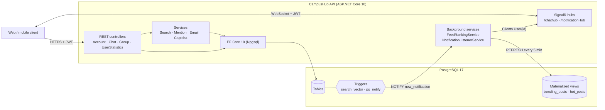

# CampusHub

[](https://github.com/lumen2adel/CampusHub/actions/workflows/ci.yml)


A social and communication platform for university students: real-time chat, interest groups with posts, polls and events, and live notifications, served as a REST + SignalR API.

CampusHub was my graduation project at **Al-Mamoun University College** (Baghdad). **Submitted 2025; improved since.** The original 2025 commit history is preserved in this repository. See [What changed since 2025](#what-changed-since-2025).

## Features

**Accounts and security**
- Registration with email verification codes, password recovery and reset
- JWT access tokens plus refresh tokens, with active-session listing, single-session revoke, and "log out everywhere"
- BCrypt password hashing, Google reCAPTCHA on sign-in, and IP-based rate limiting on login (5 requests per minute)
- Role model: `SuperAdmin`, `Admin`, `User`

**Social graph**
- Friend requests (send, accept, reject) and friend lists
- User profiles and activity statistics

**Real-time chat (SignalR, `/chathub`)**
- One-to-one and group chats
- Attachments, reactions, edits, replies, forwarding and pinned messages
- Typing indicators, read/seen receipts, online status, unread counts, message search

**Groups and posts**
- Public and private groups, join requests, admin management
- Posts with likes, comments, shares, `@mentions`, reports and moderator flagging
- Group announcements, events with participants, polls with live results
- Personalized home feed, plus **trending** (time-decayed) and **hot** (last 24 hours) posts
- Full-text and fuzzy search over posts, groups and users (PostgreSQL `tsvector` + `pg_trgm`)

**Notifications (SignalR, `/notificationHub`)**
- A database trigger publishes each new notification with `pg_notify`. A background service `LISTEN`s and pushes it to the receiving user over SignalR.

## Architecture



**How a notification travels:** a like or comment inserts a row into `Notification_Posts_Groups`. The `AFTER INSERT` trigger calls `pg_notify('new_notification', {...})`, and `NotificationListenerService`, which holds a dedicated `LISTEN` connection, receives it and pushes it to the receiver with `Clients.User(receiverId)`. Doing this in the database means every code path that creates a notification triggers a real-time push, with no extra application code.

**Design decisions and trade-offs**

| Decision | Why | Trade-off |
|---|---|---|
| Trending/hot as **materialized views** refreshed every 5 minutes | Reading the feed is a cheap indexed scan. Ranking runs once per refresh, not per request. | Up to 5 minutes stale. `REFRESH … CONCURRENTLY` needs a unique index but keeps reads unblocked. |
| Trending score `(likes + 2·comments + 3·shares) / (age_h + 2)^1.5` | Time decay ("gravity") lets fresh posts outrank old popular ones. Comments and shares signal more effort than likes. | The weights are product choices, tuned by intuition rather than data. |
| **`LISTEN/NOTIFY`** for real-time notifications | No message broker to run. The trigger guarantees no write path is missed. | At-most-once: a notification raised while the listener reconnects is not pushed live (it is still stored and readable over REST). Notifications scale out on their own because every instance `LISTEN`s and delivers to its own connections. Chat messages sent through `IHubContext` would need a SignalR backplane such as Redis. |
| Controllers use **`DbContext` directly**; services only where logic is shared | Kept the original student project simple and readable. | Large controllers that are harder to unit-test. Integration tests cover behaviour instead. |
| Secrets only from **user-secrets / environment variables** | Nothing sensitive in the repo. The app fails fast at startup if a required secret is missing. | One extra setup step per environment. |

**Project layout**

```
CampusHub/            ASP.NET Core API
  Controllers/        REST endpoints
  Hubs/               SignalR hubs (chat, notifications)
  Services/           Search, mentions, e-mail, CAPTCHA, background services
  Data/               DataContext (EF Core)
  Migrations/         EF Core migrations, including raw SQL for views, triggers and full-text search
  Classes/            Entities and DTOs
  JwtServices/        Access and refresh token generation
tests/
  CampusHub.IntegrationTests/   xUnit v3 + WebApplicationFactory + Testcontainers
```

## Tech stack

| Area | Technology |
|---|---|
| Framework | ASP.NET Core 10 Web API |
| Database | PostgreSQL 17, Entity Framework Core 10 (Npgsql), `pg_trgm`, `tsvector` |
| Real-time | SignalR |
| Auth | JWT bearer, refresh tokens, BCrypt |
| Background work | `BackgroundService` hosted services |
| Testing | xUnit v3 (Microsoft.Testing.Platform), `WebApplicationFactory`, Testcontainers |
| Delivery | Docker (multi-stage, non-root), docker compose, GitHub Actions |
| Other | SMTP email (`System.Net.Mail`), Google reCAPTCHA, Swagger / OpenAPI (Swashbuckle) |

## Running locally

### Option A: Docker (one command)

```bash
docker compose up --build
```

Then open **http://localhost:8080/swagger**. This starts PostgreSQL 17 and the API, and applies all migrations automatically. With no SMTP or reCAPTCHA settings, the compose setup runs in Development mode: verification codes are printed to the API log (`docker compose logs api`) and any CAPTCHA token is accepted. Values in `docker-compose.yml` are local demo defaults; override them in a git-ignored `.env` file.

### Option B: .NET SDK + your own PostgreSQL

**Prerequisites:** [.NET 10 SDK](https://dotnet.microsoft.com/download) and PostgreSQL 14 or later.

1. **Clone the repo and restore the tools**

   ```bash
   git clone https://github.com/lumen2adel/CampusHub.git
   cd CampusHub/CampusHub
   dotnet tool restore
   ```

2. **Configure secrets.** None are committed; see [`appsettings.Example.json`](CampusHub/appsettings.Example.json) for every key. For local development, use [user-secrets](https://learn.microsoft.com/aspnet/core/security/app-secrets):

   ```bash
   dotnet user-secrets set "ConnectionStrings:DataContext" "Host=localhost;Port=5432;Database=campushub;Username=postgres;Password=<your-password>"
   dotnet user-secrets set "jwt:Secret" "<random string, at least 32 characters>"
   dotnet user-secrets set "EmailSettings:Email" "<sender address>"
   dotnet user-secrets set "EmailSettings:Password" "<SMTP app password>"
   dotnet user-secrets set "Captcha:SecretKey" "<reCAPTCHA secret key>"
   ```

   In Docker or production, use environment variables instead. Replace each `:` with `__`, for example `jwt__Secret`.

3. **Create the database and run the API**

   ```bash
   dotnet ef database update
   dotnet run --launch-profile http
   ```

4. Open **http://localhost:5007/swagger**.

## Tests

```bash
dotnet test --solution CampusHub.sln
```

The integration tests boot the real API in memory (`WebApplicationFactory`) against a **real PostgreSQL 17 container** (Testcontainers), so Docker must be running. One container is shared by the whole run, and migrations are applied once. Tests stay independent because each creates its own users and data. E-mail and reCAPTCHA are replaced with fakes; registration goes through the real register → verify flow using the code captured by the fake inbox.

CI runs the same command on every push and pull request and publishes a test summary on the run page.

## API overview

All endpoints are documented and testable through **Swagger UI** at `/swagger`. To call protected endpoints, use the **Authorize** button and paste a JWT from `POST /api/Account/Login/login`.

Routes follow the original 2025 contract, `/api/{Controller}/{Action}/{name}` (for example `/api/Group/GetHomeFeed/homeFeed`). They are kept for compatibility with the original frontend.

| Controller | Base route | Purpose |
|---|---|---|
| Account | `/api/Account/*` | Register, verify, login, refresh, sessions, password recovery, profile, friends |
| Chat | `/api/Chat/*` | Direct and group messaging, attachments, reactions, pins, chat notifications |
| Group | `/api/Group/*` | Groups, membership, posts, feed, search, events, polls, announcements, moderation |
| UserStatistics | `/api/UserStatistics/*` | Activity tracking and user statistics |

| SignalR hub | Path | Pushes |
|---|---|---|
| ChatHub | `/chathub` | Messages, typing, reactions, edits, read receipts, friend requests |
| NotificationHub | `/notificationHub` | Database-driven notifications |

SignalR clients authenticate by passing the JWT as `?access_token=…`, because browsers can't set headers on WebSocket connections.

## What changed since 2025

The 2025 submission is preserved in the commit history (March–April 2025). Since then:

- **Security:** removed committed secrets from the entire history and moved configuration to user-secrets and environment variables. Fixed user search exposing other users' **password hashes and live password-reset tokens** (regression test included), a notification service that **broadcast every user's notifications to all clients**, and SignalR connections that were never authenticated.
- **Database:** objects that had been created by hand on the original server (feed views, notification trigger, full-text search columns) are now EF migrations, so a fresh database works. This also fixed post creation failing on a new database.
- **Platform:** .NET 8 → **.NET 10**. Removed unused dependencies, including AutoMapper, which had a CVE and whose fixed versions are commercially licensed.
- **Quality:** integration tests with Testcontainers, GitHub Actions CI, and Docker / docker compose.

## Roadmap

These known issues are planned next:

- Moderation endpoints (`getFlaggedPosts`, `unflagPost`) are open to every signed-in user and need a moderator policy (in progress)
- `getReportedPosts` reads a table that `reportPost` never writes to. A post is flagged on the 6th report rather than the 5th, and one user can report the same post repeatedly.
- `login2` skips the CAPTCHA check. Verification codes use `Random` instead of a cryptographic RNG. Login errors reveal whether an e-mail is registered.
- SignalR hubs accept anonymous connections, and trending and hot feeds include posts from private groups.

## Author

**Laith Adel**, backend developer · [GitHub](https://github.com/lumen2adel)
